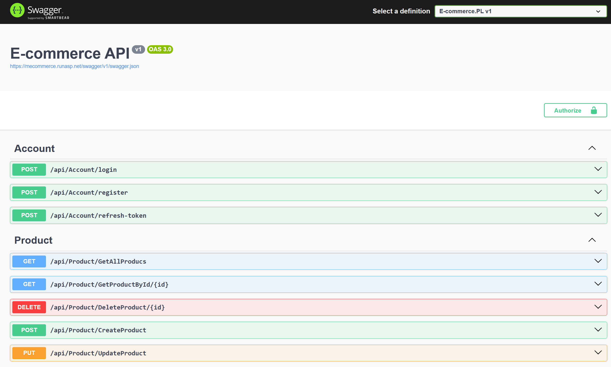

# Mini E-commerce

[](LICENSE)
[](https://dotnet.microsoft.com/)
[](https://angular.io/)

---

## 🛍️ Project Overview

This is a **Full Stack E-commerce Assignment** developed using **.NET Core Web API** for the backend and **Angular 17** for the frontend.  
The project focuses on **User authentication** and **Product management** as per the assignment requirements.

---

## 🧱 Technical Stack

### Backend

- **Technology**: .NET Core 6+  
- **Architecture**: Clean Architecture / MVC  
- **Libraries**:
  - Entity Framework Core (Database management)  
  - Swagger (API documentation)  
  - JWT (Authentication & Authorization)  
- **Features Implemented**:
  - User login with JWT authentication  
  - Refresh token mechanism  
  - CRUD for Product (Category, Product code, Name, Image, Price, Min Quantity, Discount Rate)  
- **Database**: Microsoft SQL Server (script or backup included)
- - Script included: [MiniEcommerce.sql](Mini_E-commerce/E-commerce.PL/DataBaseScript.sql)
- **Links**:
  - GitHub Repository: [Mini_E-commerce](https://github.com/Tokaessam81/Mini_E-commerce.git)  
  - API Documentation: [Swagger UI](https://mecommerce.runasp.net/swagger/index.html)  

---

### Frontend

- **Technology**: Angular 17  
- **Features Implemented**:
  - Login page with JWT authentication  
  - Product Crud operation
- **Links**:
  - GitHub Repository: [ecommerce-frontend](https://github.com/Tokaessam81/ecommerce-frontend.git)  
  - Live App: [Frontend App](https://ecommerce-frontend-chi-ruddy.vercel.app/login)  

---

## 🧪 Local Setup

### Backend

```bash
git clone https://github.com/Tokaessam81/Mini_E-commerce.git
```
cd Mini_E-commerce
# Configure database using EF Core
# Run the backend project
### Swagger Screenshot

